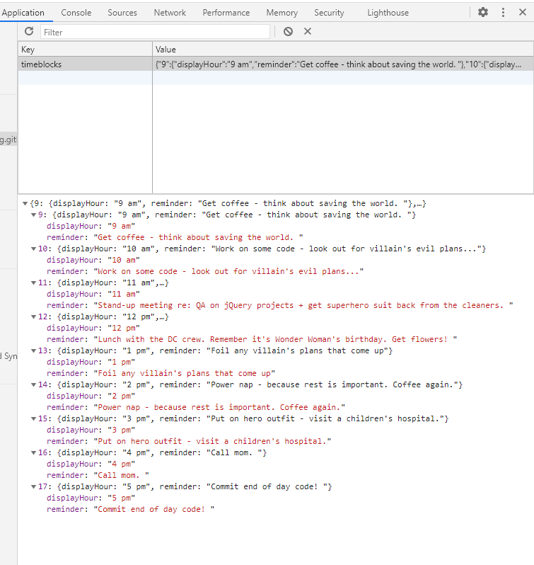

# Skye Lucking - 05 Workday Planner with Hero Option!

<h1>Description of application</h1>
Do you ever feel like it's a heroic act just to show up to work? Well, you are in luck! This workday planner allows you to plan your day in normal or hero mode! Both modes will show you the events of your day saved from local storage - be it finishing up your code project or fighting off evil villans!
<ul>

<li>Time blocks show up and offer a space to input and save tasks. </li>
<li> Time blocks are color coded for past, present, future.</li>
<li>current date and time are shown at the top of the interface</li>
<li>Select HERO or NORMIE mode depending on your mood</li>
<li> Enjoy!</li>
</ul>

<h1>Screenshot</h1>
 
 
 

<h1>Link to the deployed application</h1>
<a href="https://skyelucking.github.io/05-Work-Day-Scheduler/">https://skyelucking.github.io/05-Work-Day-Scheduler/</a>

<h1>Link to GitHub Repo</h1>
<a href="https://github.com/skyelucking/05-Work-Day-Scheduler">https://github.com/skyelucking/05-Work-Day-Scheduler</a>

Now here is your joke... 
What do you call a computer superhero?
 
 
 
<em>A screensaver</em>
